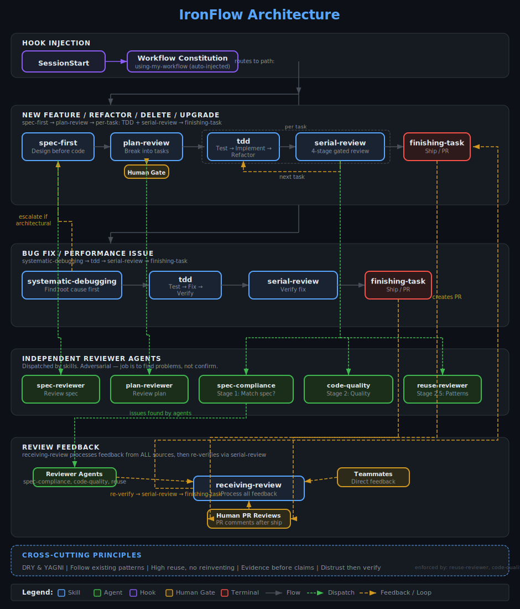

# IronFlow

[](https://claude.ai/code)
[](https://github.com/Zhijiang-Li1111/ironflow)
[](https://opensource.org/licenses/MIT)
[](https://github.com/Zhijiang-Li1111/ironflow/stargazers)
[](https://github.com/Zhijiang-Li1111/ironflow/network/members)

A Claude Code plugin that enforces a rigorous development workflow: spec-first design, plan with human review, TDD, serial gated review, and structured branch finishing.

## Install

```bash
/plugin marketplace add Zhijiang-Li1111/ironflow
/plugin install ironflow
```

Then restart Claude Code or run `/clear`.

## Update

```bash
/plugin marketplace update ironflow
/plugin install ironflow
/reload-plugins
```

## What It Does

ironflow injects a workflow constitution into every Claude Code session via a SessionStart hook. It routes tasks into one of two paths and enforces each step through skills and independent reviewer agents.

### New Feature / Refactor / Delete / Upgrade

```
spec-first → plan-review (human confirms) → TDD → serial-review → finishing-branch
```

### Bug Fix / Performance Issue

```
systematic-debugging → TDD → serial-review → finishing-branch
```

### Mixed Tasks

Decomposed into separate tasks. Bug fix path runs first, then new feature path. Each ends with finishing-branch.

## Architecture



## Skills

| Skill | When It Triggers |
|-------|-----------------|
| **spec-first** | Building, creating, refactoring, removing features, upgrading dependencies |
| **plan-review** | Spec approved, ready to break into implementation tasks |
| **tdd** | About to write production code or fix a bug |
| **serial-review** | Implementation done, needs gated review before completion |
| **systematic-debugging** | Bug reported, test fails, build breaks, performance issue |
| **finishing-branch** | All reviews pass, ready to integrate |
| **receiving-review** | Code review feedback arrives from reviewers or PR comments |
| **using-my-workflow** | User asks about available skills (auto-injected, not manually triggered) |

## Review Pipeline (serial-review)

Each stage must pass before the next begins:

1. **Spec Compliance** — Does the implementation match what was requested?
2. **Code Quality** — Patterns, error handling, testing, dead code, architecture
3. **Reuse & Pattern Review** *(large projects only)* — Reinvented wheels? Pattern violations?
4. **Smoke Test** — Real-world verification, not just "tests pass"

## Agents

| Agent | Role |
|-------|------|
| **spec-reviewer** | Find problems in spec documents before planning |
| **plan-reviewer** | Find gaps in implementation plans before coding |
| **spec-compliance-reviewer** | Verify implementation matches spec — distrust implementer reports |
| **code-quality-reviewer** | Find quality issues, dead code, architectural problems |
| **reuse-reviewer** | Find reinvented wheels and pattern violations (large projects) |

All reviewers take an independent, adversarial stance: their job is to find problems, not confirm things are good.

## Key Principles

- **Spec before code** — understand before building
- **Plan with human gate** — user confirms the plan before implementation starts
- **TDD** — write the failing test first, always
- **Serial gated review** — spec compliance before code quality, no skipping
- **Distrust then verify** — reviewers read code independently, don't trust implementer reports
- **Evidence before claims** — run verification, read output, then claim. Never "should work"
- **Workaround transparency** — disclosed in plan and final summary
- **Finishing with summary** — present what was built to user before merge/PR
- **Follow existing patterns** — search the project first, don't reinvent

## Project Structure

```
ironflow/
├── .claude-plugin/
│   ├── plugin.json
│   └── marketplace.json
├── hooks/
│   ├── hooks.json
│   └── session-start
├── skills/
│   ├── using-my-workflow/SKILL.md
│   ├── spec-first/SKILL.md
│   ├── plan-review/SKILL.md
│   ├── tdd/SKILL.md
│   ├── serial-review/SKILL.md
│   ├── systematic-debugging/SKILL.md
│   ├── finishing-branch/SKILL.md
│   └── receiving-review/SKILL.md
└── agents/
    ├── spec-reviewer.md
    ├── plan-reviewer.md
    ├── spec-compliance-reviewer.md
    ├── code-quality-reviewer.md
    └── reuse-reviewer.md
```

## License

MIT

## Security & Privacy Hygiene

- `.gitignore` now blocks common local secret files (for example `.env`, `*.pem`, `*.key`, `*.p12`).
- `.mailmap` normalizes historical local author identity display to GitHub noreply identity.
- If you need to fully scrub already-pushed commit metadata from remote history, rewrite history as a maintainer operation (for example with `git filter-repo`) and force-push deliberately.
